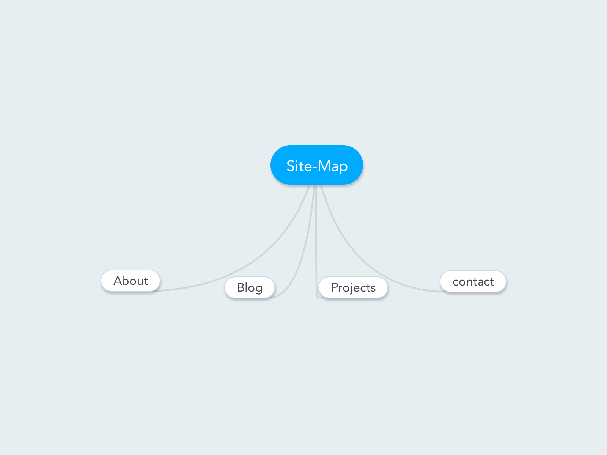

1 What are the 6 Phases of Web Design?

  The 6 phases of web design are:

    1.Information gathering
    2.Planning
    3.Design
    4.Development
    5.Testing and Delivery
    6.Maintenance

  2 What is your site's primary goal or purpose? What kind of content will your site feature?

    The goal of my website is to appear as a link between me and employers. In my website, I will include background information, projects I have been involved in, keep blogs about my leanings.

  3 What is your target audience's interests and how do you see your site addressing them?

    My audience’s target will be to find someone who has the specific skills they need. I will make sure to be specific on what am offering and to keep the keywords as visible as possible and also write a blog as often as I can about my learnings about different topics.

  4 What is the primary "action" the user should take when coming to your site? Do you want them to search for information, contact you, or see your portfolio? It's ok to have several actions at once, or different actions for different kinds of visitors.

    I hope the first thing they do after coming to my website is contacting me

  5 What are the main things someone should know about design and user experience?

    The main things to know about user experience and design is :
      1.User experience is how a person feels when interfacing with the website and user experience design  is about determining what the experience will be.

      2.There is no “one size fits all ” way of design. The website design varies as it has different purpose, goal and target audience so we can not replicate one website’s user experience to another

      3.we can not directly assess user experience using traditional metrics.

  6 What is user experience design and why is it valuable?

    User experience design is the process by which we determine what the experience we want to give the people who will use the websites. User experience design is valuable because if we have a website and if our target group were not able to utilize the content as quickly as possible, there is a big chance that they leave the page. It is a good experience to put into account the users while designing a website.

  7 Which parts of the challenge did you find tedious?

    I still didn’t figure out how i make a relative path for my png fie. Hopefully before week-2 is over, I will manage to get it.