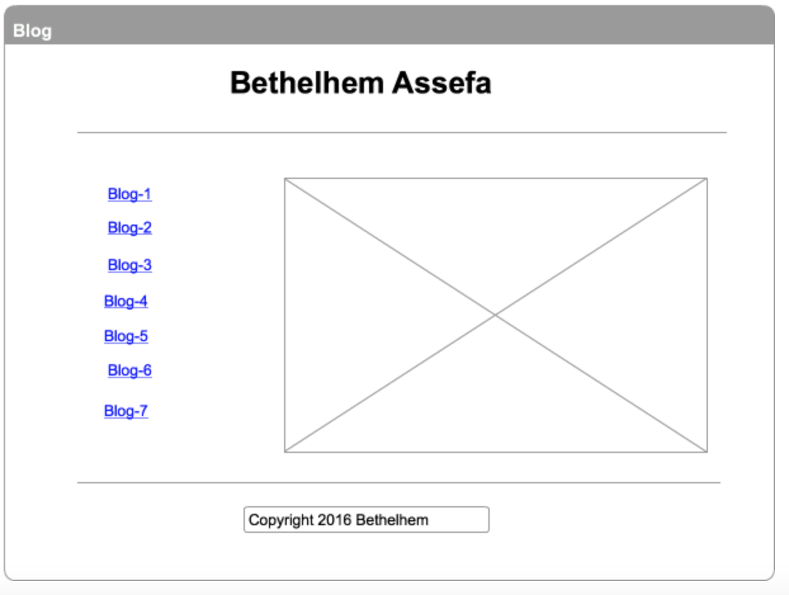

# Reflection on wireframe

•What is a wireframe?

  Wireframe is a visualizing tool for presenting the structure, content and functions of a website. It’s like a guide to show how a page of a website may look.

•What are the benefits of wireframing?

  Wireframe is important because 1) It allows to design the information hierarchy of the website 2) It makes it easier for you to plan the layout as the way you present it for your users. you are able to get to see the design process before its even get designed.

•Did you enjoy wireframing your site?

  Yes I did. It was a bit challenging but at the same time it was fun.

•Did you revise your wireframe or stick with your first idea?

  Yes I did, I was going back and forth to see what I included in my sitemap and what I wanted to add now. It seems designing does require thinking and more time than i thought.

•What questions did you ask during this challenge? What resources did you find to help you answer them?

  The question that I was asking my self is how I actually want my website to look like and how am I able to get it look professional. I tried to find some sample sites from the web which unfortunately looking complicated

•Which parts of the challenge did you enjoy and which parts did you find tedious?

  I think making the wireframes are challenging and also tedious. Usually I just read the contents from a website but never bothered to see the design so now am designing one, it gave me a hard time to figure out how I wanted it to be so I took more time on this thinking and designing. Hopefully, I did a great job.