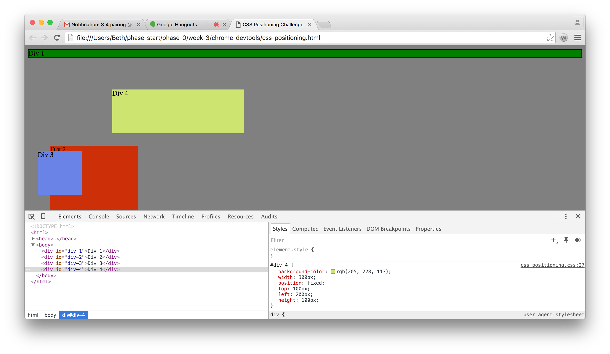
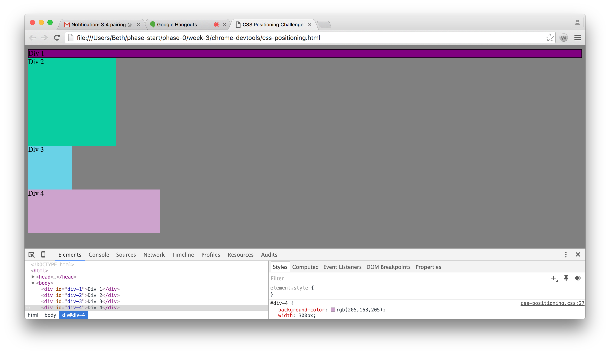
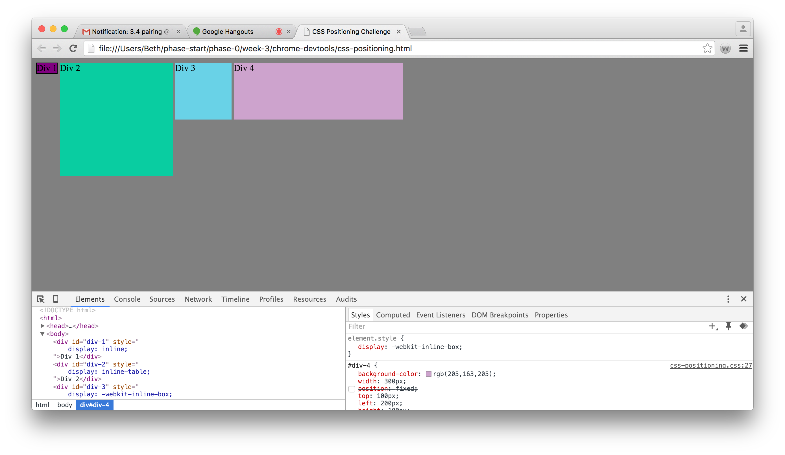
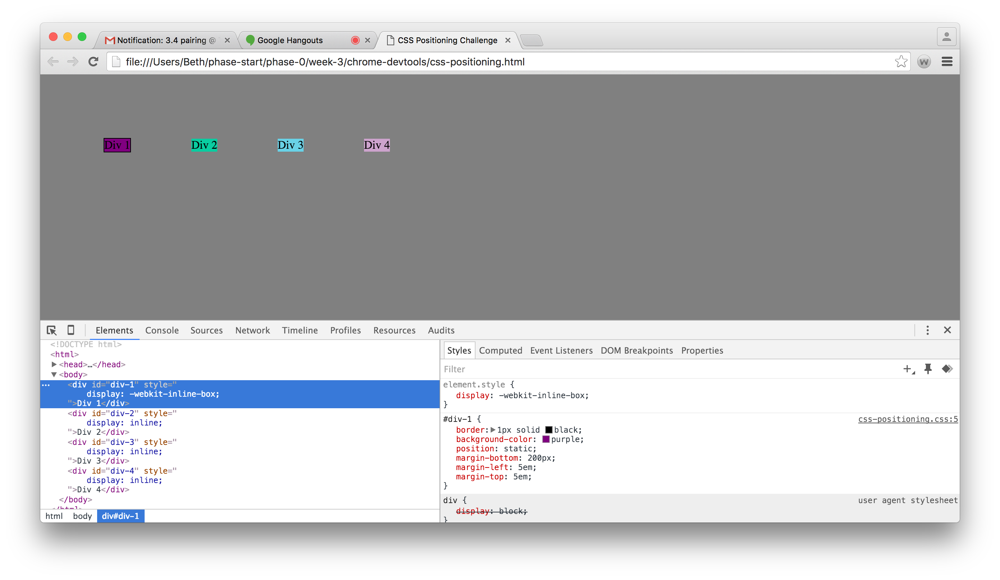
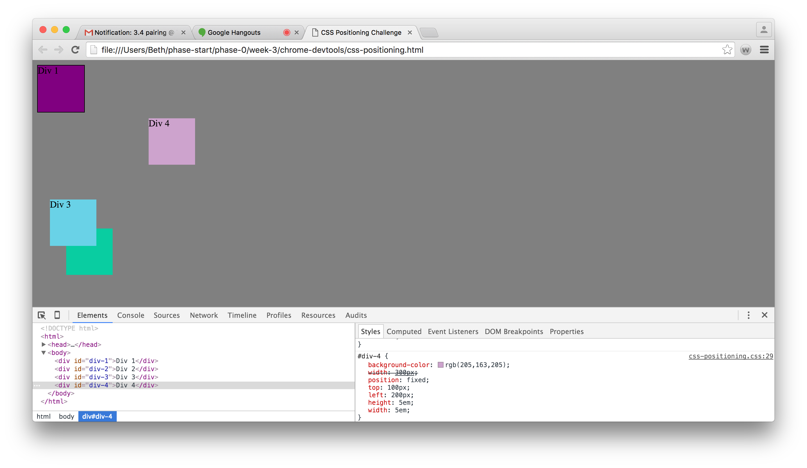
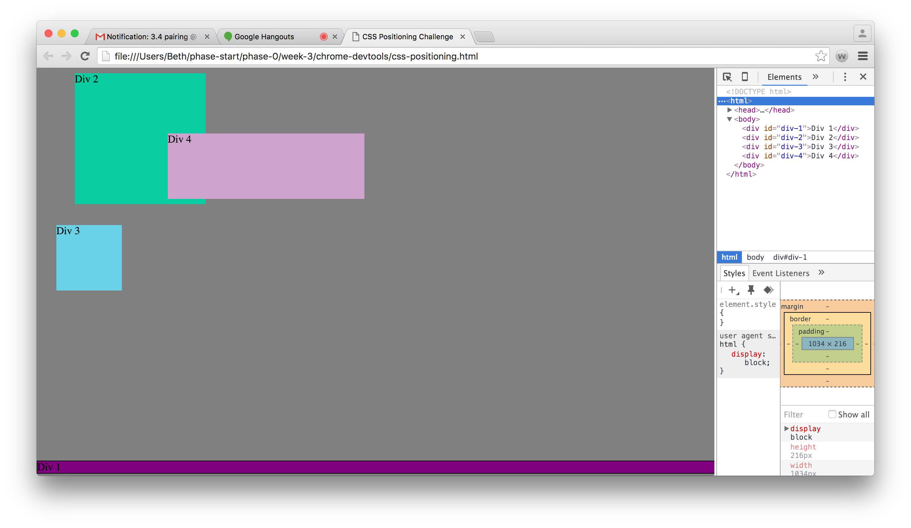
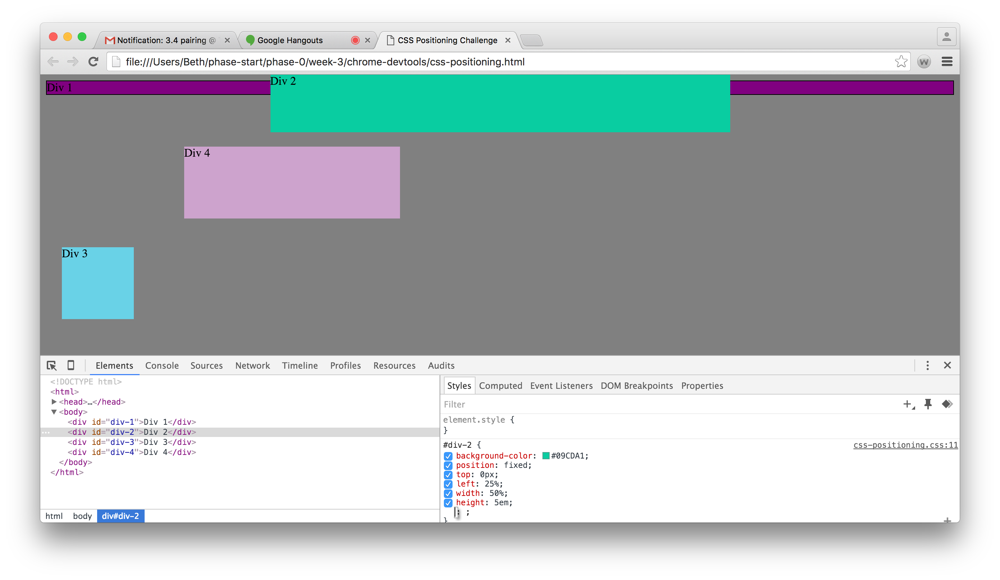
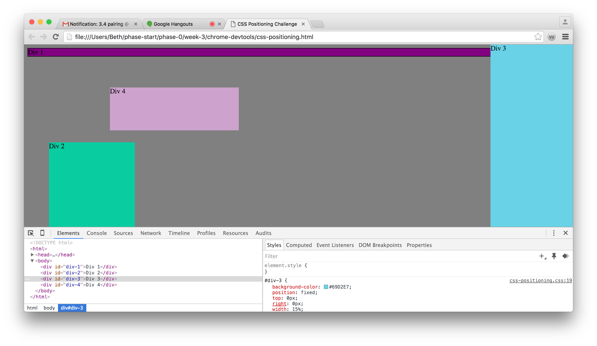
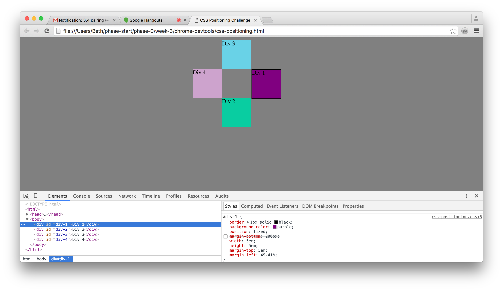

#How can you use Chrome's DevTools inspector to help you format or position elements?

  The inspector helps by having the project open in the browser and the inspector right there on screen you're able to quickly edit any changes and see how it effects the overall layout.

#How can you resize elements on the DOM using CSS?
  css allows you to control the hight and width of an object so you are able to change the size. you can use px or em to scale your changes.
#What are the differences between absolute, fixed, static, and relative positioning? Which did you find easiest to use? Which was most difficult?

  Absolute is always in position as in relation to its nearest positioned anscestor.Fixed positioning place the object in relation to the viewport meaning that even if the page scrolls the object remains in place. Static positioning isn't effected by top, bottom, left, or right properties so that it is positioned based on the flow of the page and lastly, relative positioning is placing the object based on its normal position. Adjusting top, bottom, left or right will move it away from its normal position. working with fixed positioning is easier since I am able to see where I positioned it through out the page.

#What are the differences between margin, border, and padding?

  Margin - clears a space outside the border.
  Border - is some space or line that goes around the padding and content.
  Padding - Clears an area around the content.

#What was your impression of this challenge overall? (love, hate, and why?)

  Its pretty awsome to be able to navigate through CSS codes and notice the changes in a browser right there. I still need to master it for myself but so far, its good.
