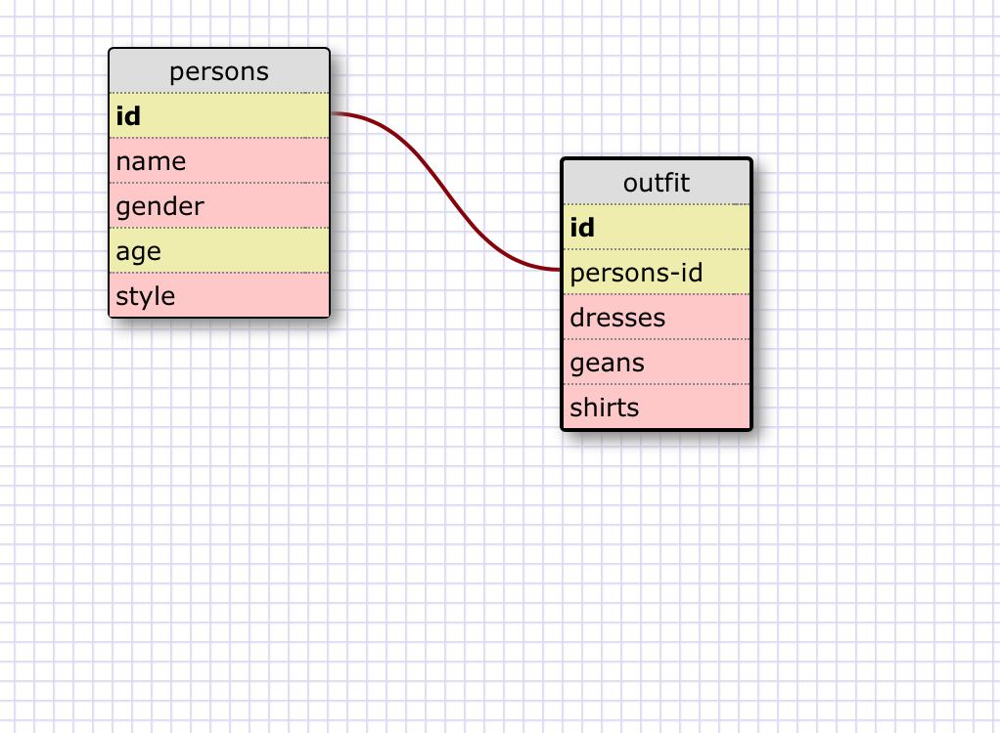

1) SELECT * FROM states;

2) SELECT * FROM regions;

3) SELECT state_name,population
   FROM states;

4) SELECT state_name, population
   FROM states
   ORDER BY population DESC;

5) SELECT state_name
   FROM states
   WHERE region_id = 7;

6) SELECT state_name, population_density
   FROM states
   WHERE population_density > 50
   ORDER BY population_density;

7) SELECT state_name
   FROM states
   WHERE population BETWEEN 1000000 AND 1500000;

8) SELECT state_name,region_id
   FROM states
   ORDER BY region_id ASC;

9) SELECT region_name
   FROM regions
   WHERE region_name LIKE '%Central%';

10) SELECT regions.region_name, states.state_name
    FROM regions
    JOIN states ON
       regions.id = states.region_id
    ORDER BY states.region_id;

## Reflection

• What are databases for?

    databases are for storing any data in a very organized way. databases make it easier to acess, manage and update datas into/from the collection.

• What is a one-to-many relationship?

    One to many relation ship is lets say we have a customer and address table. and in our cusomer table,we can have one customer who have multiple addresses. that is what one-to-many relationship means.

• What is a primary key? What is a foreign key? How can you determine which is which?

    Primary key is a key which will make sure there is no NULL values and also NO DUPLICATE in our records. its unique for all the data and its number indexed where as a Foreign key is a key which refers to a data in another table and creates a relationship between those two tables. values in specified column must reference an existing record in another table.

• How can you select information out of a SQL database? What are some general guidelines for that?

   using a SELECT key word to select any information along with FROM key word  to specify from where/which table we wanted to select that information.

