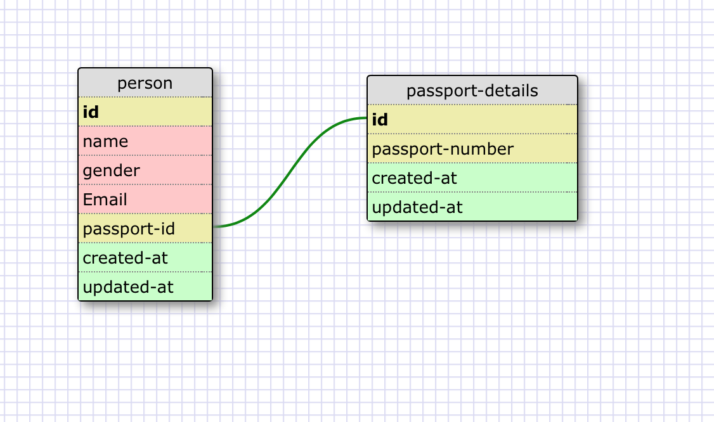
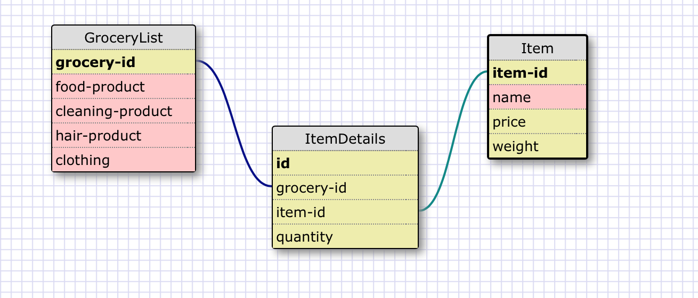

## Reflection
1)What is a one-to-one database?

    In a one-to-one relationship, each row in one database table is linked to 1 and only 1 other row in another table. In a one-to-one relationship between Table A and Table B, each row in Table A is linked to another row in Table B. The number of rows in Table A must equal the number of rows in Table B.

2)When would you use a one-to-one database? (Think generally, not in terms of the example you created).

    Use a one-to-one relationship if you have a relationship where a group of fields can all optionally be empty. And also if some of the fields are not the one we commonly use in a data, its better to create another table and put them differently using one-to-one relationship which helps to improve the performance whenever a querry is executed.

3)What is a many-to-many database?

    In a many-to-many relationship, one or more rows in a table can be related to 0, 1 or many rows in another table. In a many-to-many relationship between Table A and Table B, each row in Table A is linked to 0, 1 or many rows in Table B and vice versa. A 3rd table called a mapping table is required in order to implement such a relationship.

4)When would you use a many-to-many database? (Think generally, not in terms of the example you created).

    The many-to-many database relationship is used when you are in the situation where the rows in the first table can map to multiple rows in the second table… and those rows in the second table can also map to multiple (different) rows in the first table.
5)What is confusing about database schemas? What makes sense?

    Its confusing to create the relationships. which one is the parent table and which one is the child inorder to say this table has primary key and this one has a foreign key, how can I say its one to one relationship or one-to-many? but all it needs is to give it more attention and know what exactly we want to design.